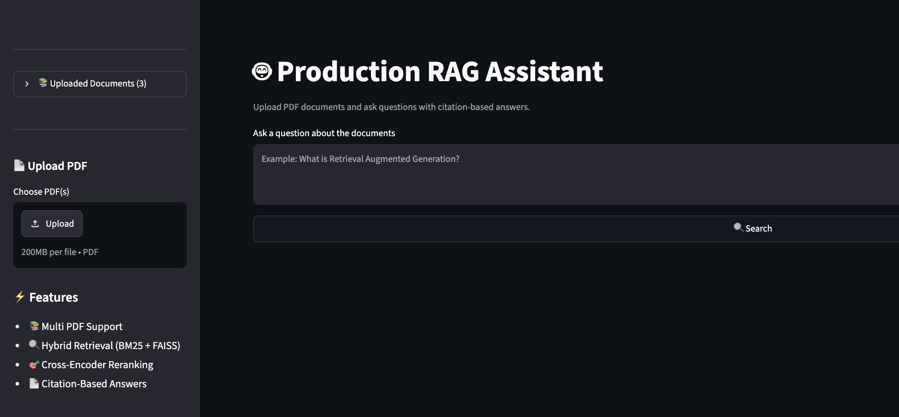
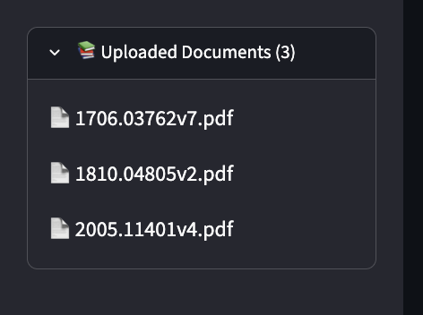
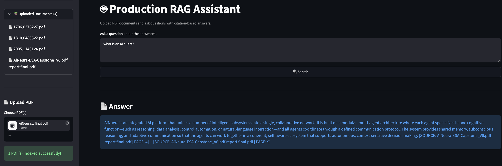

# 🤖 Production RAG Assistant

A production-ready Retrieval-Augmented Generation (RAG) application that enables users to chat with PDF documents using **Hybrid Search (BM25 + FAISS)**, **Cross-Encoder Reranking**, and **Citation-Based Responses** through an intuitive Streamlit interface.

---

## 📸 Screenshots

| Home Page | Upload Documents |
|-----------|------------------|
|  |  |

### 💬 Question Answering



---

## 🚀 Features

- 📄 Multi-PDF Upload
- ⚡ Automatic FAISS Indexing
- 🔍 Hybrid Retrieval (BM25 + FAISS)
- 🎯 Cross-Encoder Reranking
- 📖 Citation-Based Answers
- 💬 Natural Language Question Answering
- 🖥️ Streamlit Web Interface
- 🧪 Automated Testing with Pytest
- 🔄 GitHub Actions CI Pipeline

---

## 🏗️ Architecture

```text
                User Question
                      │
                      ▼
        Hybrid Retrieval (BM25 + FAISS)
                      │
                      ▼
         Cross-Encoder Reranking
                      │
                      ▼
             Context Construction
                      │
                      ▼
              LLM Response Generation
                      │
                      ▼
          Citation-Based Answer
                      │
                      ▼
               Streamlit Interface
```

---

## 🛠️ Tech Stack

- Python
- LangChain
- FAISS
- Rank-BM25
- Hugging Face Embeddings
- Sentence Transformers
- Cross-Encoder Reranker
- Streamlit
- Pytest
- GitHub Actions

---

## 📂 Project Structure

```text
production-rag1/
│
├── assets/
│   └── screenshots/
│
├── data/
│   └── docs/
│
├── src/
│   ├── chunker.py
│   ├── ingest.py
│   ├── vector_store.py
│   ├── bm25_store.py
│   ├── retriever.py
│   ├── reranker.py
│   ├── rag_chain.py
│   └── evaluator.py
│
├── tests/
│   └── test_rag.py
│
├── app.py
├── requirements.txt
├── README.md
└── .gitignore
```

> **Note:** `faiss_index/` is generated automatically when documents are indexed and is intentionally excluded from the repository.

---

## ⚙️ Installation

```bash
git clone https://github.com/pes1ug23am346/production-rag1.git

cd production-rag1

python -m venv venv

source venv/bin/activate

pip install -r requirements.txt
```

---

## ▶️ Run the Application

```bash
streamlit run app.py
```

Open your browser and visit:

```text
http://localhost:8501
```

---

## 🧪 Run Tests

```bash
pytest tests/test_rag.py -v
```

---

## 💬 Example Questions

- What is Retrieval-Augmented Generation?
- Explain Hybrid Search.
- Summarize the uploaded paper.
- What are the key findings of this research?
- How does Cross-Encoder Reranking improve retrieval quality?

---

## ✅ Current Status

- ✅ Multi-PDF Upload
- ✅ Automatic FAISS Indexing
- ✅ Hybrid Retrieval (BM25 + FAISS)
- ✅ Cross-Encoder Reranking
- ✅ Citation-Based Responses
- ✅ Streamlit Web Interface
- ✅ Automated Testing
- ✅ GitHub Actions CI

---

## 🔮 Future Improvements

- 🗑️ Delete Uploaded Documents
- 💬 Conversational Memory
- ☁️ Cloud Deployment
- 🐳 Docker Support
- 📊 Retrieval Analytics Dashboard

---

## 👨‍💻 Author

**Veerendra R Lashkare**

B.Tech – Computer Science & Engineering (AI & ML)

PES University